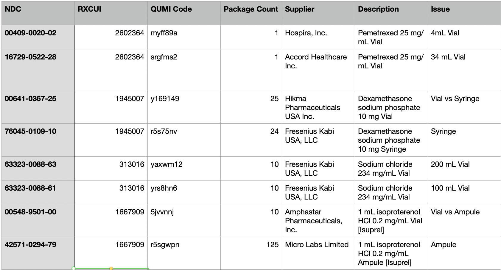

# QuicksortRx Universal Medication Identifiers (QUMI Codes)

## **Introduction**

Welcome to the [QuicksortRx](https://quicksortrx.com) Universal Medication Identifier (QUMI) repository! We believe everyone in pharmacy should have access to a unified medication ID, and we have created an open-source solution to deliver it. Here, we combine the power of OpenFDA data with RXNorm data to algorithmically generate a universal, freely available generic code for medications. This revolutionary approach enables the matching of two National Drug Codes (NDCs) to determine their operational interchangeability (equivalent size, strength, form etc.), facilitating the identification of alternative medications and streamlining medication management processes for hospitals and pharmacists worldwide. Unlike other generic codes, QUMI codes incorporate operational critical data to assure the two NDCs are interchangeable, and do not require any licensing fees.

### License

QUMI codes are provided under a modified MIT license (see LICENSE) that allows for the free use of these codes within any software platform, free of charge. For commercial offerings, we require that you refer to these codes as “QuicksortRx Universal Medication IDs” (QUMI codes for short), and provide attribution to QuicksortRx Inc. The codes are otherwise free to use for commercial use, and do not require licensing any third-part data. There are no limitations for non-commercial use of QUMI codes.

### **About QuicksortRx**

[QuicksortRx](https://quicksortrx.com) provides timely, transparent, and actionable guidance to help health systems make better pharmacy procurement decisions. Our team, prominently including our intern Jack Rose, has created this groundbreaking solution to address the challenges faced by healthcare professionals when searching for alternative medications and establishing a unified medication ID within their organizations.

### **The Need for a Universal Medication Identifier**

In the healthcare industry, pharmacies, hospitals, and other healthcare facilities deal with a vast array of medications, each identified by its unique NDC. While this specificity is essential for ensuring accurate dispensing and tracking of medications, it also presents challenges when pharmacists need to find operational equivalents or alternative medications to fulfill patient needs. The absence of a standardized universal medication identifier has hindered efficiency and interoperability within the industry.

[QuicksortRx](https://quicksortrx.com) recognized this critical issue and set out to develop a solution that would empower healthcare professionals with a comprehensive, license-free, and universally applicable medication identification system.

### **How QuicksortRx Universal Medication Identifier Works**

The [QuicksortRx](https://quicksortrx.com) Universal Medication Identifier combines the wealth of information available through the OpenFDA and RXNorm databases. By applying advanced algorithms, our software can automatically generate generic codes that accurately identify operational equivalents for different NDCs.

This powerful identifier not only helps pharmacists quickly find alternative medications but also assists hospitals and other healthcare organizations in streamlining their internal medication management systems. The universal medication identifier allows for seamless integration with existing healthcare software, electronic health records (EHRs), and pharmacy management systems, ensuring a consistent and standardized approach to medication identification across the board.

We estimate the RxCUIs cover 56% of interchangable products on the market, but still cause many issues for supply chain analytics. For those interested in auto-substitution of ordered products, RxCUIs tend to create far more issues than they solve.

### **Key Features**

- **Algorithmic Matching**: Our software employs sophisticated algorithms to match NDCs based on OpenFDA and RXNorm data, enabling users to find operationally equivalent medications swiftly.
- **Open Source License**: We believe that access to crucial healthcare data should not be hampered by expensive licensing constraints. Therefore, QuicksortRx Universal Medication Identifier is  open-source and available for use by health systems as well as commercial entities (see branding and attribution requirements for commercial-use).
- **Interoperability**: With a universal medication identifier, healthcare facilities can achieve better interoperability between their systems, promoting streamlined processes and reducing errors.

### Current Limitations and Future Plans

- We targeted injectable drugs first, since they present the most problems when evaluating operational equivalence. We estimate our injectable drug match accuracy at 96%
- We are expanding to cover all forms of drugs including oral tablet, creams, patches, inhalers, etc.
- We plan to manage and publish monthly releases by Q4 of this year
- Biologics do not share the same codes currently (coming soon)
- We are looking for an open data source of preservative-free information on NDCs. PF distinction is not currently supported, and must be certified by a pharmacist when evaluating two NDCs.
- Current codes are alpha-numeric and generated algorithmically, we plan to introduce numeric sequential codes in the next few months to increase compatibility with existing systems

### **Warranty and Accuracy of QUMI Codes**

QuicksortRx has employed rigorous testing and verification procedures to certify the QuicksortRx Universal Medication Identifier (QUMI codes) with an accuracy rate of above 95%. These QUMI codes have been meticulously generated through a combination of OpenFDA and RXNorm data, using innovative algorithms to enable the matching of two National Drug Codes (NDCs) for their operational equivalence.

However, the user should be aware that while the QUMI codes are provided with high accuracy, QuicksortRx Inc. cannot vouch for the validity of any individual code at this time and expressly disclaims any warranty, either express or implied, regarding these codes. The accuracy of a specific QUMI code is contingent on various factors, including the reliability and completeness of the data sources from which it is derived. As such, no warranty is made as to the fitness for a particular purpose, merchantability, or non-infringement of the QUMI codes.

It is the responsibility of the pharmacist or other qualified healthcare professional to verify the validity of any QUMI code at the time of usage. Utilizing the QuicksortRx Universal Medication Identifier does not absolve healthcare providers from adhering to professional standards and regulations governing the identification, handling, and dispensing of medications.

QuicksortRx Inc. will not be liable for any direct, indirect, incidental, consequential, or special damages, including but not limited to loss of revenue, arising out of or in connection with the use or inability to use the QUMI codes, even if QuicksortRx Inc. has been advised of the possibility of such damages.

Your use of the QuicksortRx Universal Medication Identifier signifies your understanding and acceptance of these terms and conditions.

By leveraging the QuicksortRx Universal Medication Identifier in alignment with these guidelines, healthcare professionals can streamline medication management processes and facilitate the identification of alternative medications, while recognizing that the final validation rests with the professional judgment and expertise of the pharmacist or healthcare provider.

### Example Data

Examples of NDCs that share the same RxCUI but are distinctly different products by size and form. 



[Click here to download full example.](https://github.com/QuicksortRx/universal-med-ids/blob/main/universal-med-ids.csv) 
## Installation

These instructions start from square one on how to run this script. This ensures that anyone with any level of experience will be able to easily use this program. Some steps may be unnecessary depending on your current setup and experience. For ease of universality, the instructions will be sequentially presented for use in a Unix command-line interface (CLI).

### Accessing a Unix CLI

- **Windows**:
    
    If you want a Unix CLI on a Windows machine, consider using the Windows Subsystem for Linux (WSL). Below are instructions on how to install and access it.
    
    1. Open PowerShell as Administrator. To do this, search for PowerShell in the Start menu, right-click on it, and select 'Run as administrator'.
    2. Run the following command `wsl —install` to enable the Windows Subsystem for Linux.
    3. Wait for your system to restart after the command completes.
    4. After your system restarts, open the Microsoft Store and search for the Linux distribution you want (for example, Ubuntu). Click on 'Get' to install it.
    5. Once the Linux distribution is installed, launch it from the Start menu. Wait for it to finish setting up.
    6. You should now be able to use Linux commands directly from this application.
- **macOS**:
    
    Open your terminal. You can do this by going to Finder > Applications > Utilities > Terminal. 
    
- ******Linux******:
    
    Simply use the shortcut ‘**Ctrl+Alt+T**’.
    

### Installing Necessary Packages

Once you have your Unix CLI accessed, you can install Homebrew, a package manager, by pasting the following command and pressing ‘**********Enter**********’ (’************Return************’):

```bash
/bin/bash -c "$(curl -fsSL https://raw.githubusercontent.com/Homebrew/install/HEAD/install.sh)"
```

After Homebrew is installed, you can use it to install other packages. Before running the following commands, you should update Homebrew to make sure you are installing the latest versions of these packages. You can update Homebrew by typing the command `brew update` and pressing ‘**********Enter**********’.

- To install Python (including pip) and Git, run the following commands. To do this, you will type each line one at a time, hitting the ‘**********Enter**********’ key after each line is typed and waiting for the command to be executed.

```bash
brew install python
brew install git
```

- Verify Python, pip, and Git installation by running the following commands. After each line is executed, the version installed will be displayed. *************Note, depending on your configuration, the commands `python3` and `pip3` may only need to be `python` and `pip`.*

```bash
python3 --version
pip3 --version
git --version
```

### Setting Up the Directory and Virtual Environment

- In your CLI (Terminal), navigate to the location where you want to create a new directory for the Open QSRX Codes repository. Create this new directory by cloning this repository, and then navigate to this new directory. For example, if you want to create this directory on your Desktop, the commands would be:

```bash
cd ~/Desktop
git clone https://github.com/QuicksortRx/universal-med-ids.git
cd universal-med-ids
```

- Then, create and activate a virtual environment as well as install dependencies (NumPy, pandas, and SQLAlchemy) by running the subsequent commands:

```bash
python3 -m venv venv
source venv/bin/activate
pip3 install -r requirements.txt
```

- Finally, create a subdirectory called “data” to store the data that will be utilized, and navigate to this subdirectory:

```bash
mkdir data
cd data
```

### Getting rxnorm.db

- ********************************************************Retrieving the RxNorm native data:********************************************************
    1. Arrive at the [NLM RxNorm webpage](https://www.nlm.nih.gov/research/umls/rxnorm/index.html).
    2. Click on ‘**RxNorm Files**’ under “Data Downloads and Applications”.
    3. Go under the latest “RxNorm Full Monthly Release” at the top and download the ZIP file (you will have to log in).
    4. Double click on the ZIP file in your Downloads to unzip it
- ****************************Converting the RxNorm native data to a DB file:****************************
    
    Return to your CLI where you have previously navigated to the subdirectory “data”.  In order to convert the native data to a DB file, you will clone the GitHub repository for [py-umls](https://github.com/chb/py-umls). In order to do this and carry out the file conversion, you can run the subsequent commands. **Note, where it is written `RxNorm_full_07032023`, this name will be the name of the file you have downloaded and will have a different name depending on the monthly release. Replace this part of the following code with the name of the release file you downloaded.*
    

```bash
git clone https://github.com/chb/py-umls.git
cd py-umls
cd databases
./rxnorm.sh ~/Downloads/RxNorm_full_07032023
mv rxnorm.db ../../rxnorm.db
cd ../../
```

### Gathering FDA Data

1. Arrive at the [FDA NDC directory webpage](https://www.fda.gov/drugs/drug-approvals-and-databases/national-drug-code-directory).
2. Click on ‘**************************************************************NDC database file - Excel version (zip format)**************************************************************’ under “Additional References”.
3. A folder called “ndcxls” should now be in your Downloads containing two XLS files. Convert each of these files to CSV format . You can do this by opening them in your choice of a spreadsheet application and exporting them as a CSV to your data subdirectory. You can follow these steps to do this.
- ********************************Microsoft Excel:********************************
    1. Open Microsoft Excel.
    2. Open the file you want to convert.
    3. Click on “File” in the top-left corner.
    4. Choose “Save As” or “Export.”
    5. Select “CSV” as the file format.
    6. Choose your data subdirectory as your location (for instance, if you followed all previous steps exactly, you would put it in the folder called “data” in a folder called “universal-med-ids” in “Desktop”) and enter a name (i.e. “package.csv” and “product.csv” respectively) for the new CSV file.
    7. Click "Save."
- **********Apple Numbers:**********
    1. Open Apple Numbers.
    2. Open the file you want to convert.
    3. Click on “File” in the top-left corner.
    4. Choose “Export To” > “CSV...”
    5. Select ‘**Unicode (UTF-8)**’ under “Text Encoding”.
    6. Click “Save...”
    7. Choose your data subdirectory as your location (for instance, if you followed all previous steps exactly, you would put it in the folder called “data” in a folder called “universal-med-ids” in “Desktop”) and enter a name (i.e. “package.csv” and “product.csv” respectively) for the new CSV file.
    8. Click “Export.”
- ************Google Sheets:************
    1. Open Google Sheets.
    2. Open the file you want to convert.
    3. Click on “File” in the top-left corner.
    4. Choose “Download” > “Comma-separated values (.csv, current sheet).”
    5. The CSV file will download to your computer's default download location.
    6. Open your Downloads folder where the file saved to.
    7. Rename the file to either “package.csv” or “product.csv” respectively if needed by right-clicking the file and choosing “Rename”.
    8. Right-click the file, then choose “Cut” or “Copy”. Navigate to your “data” subdirectory where you want to move the file, right-click again, and choose “Paste” (for instance, if you followed all previous steps exactly, you would put it in the folder called “data” in a folder called “universal-med-ids” in “Desktop”).

### Final Pre-check

- Return to your CLI where you have previously navigated to the subdirectory “data”, and run the command `ls`, this will show the contents of your directory. Ensure that you see the necessary `rxnorm.db`, `package.csv`, and `product.csv` (you should also see the folder `py-umls`, but it is no longer needed at this point and can be deleted if desired).
    - If you do not see them, ensure you are in the right directory by running the command `cd` followed by the data subdirectory’s pathname (in our example directory location, you would run `cd ~/Desktop/universal-med-ids/data`). Run `ls` again.
    - If this still fails to yield the desired results, search for the files on your computer and move them in a similar fashion as **************************Google Sheets************************** step 8 under “************************************Gathering FDA Data”************************************. Run `ls` again and you should now see the desired results.
- After running the commands below, you should see the necessary `qumi-codes.py` and the folder `data` (there may also be other contents in the directory, but those are not necessary to check for the functioning of the script).

```bash
cd ../
ls
```

### Generating the Codes

- In order to generate the codes, run the command below. **Note, you can replace* `*universal-med-ids.csv` with whatever CSV filename you please.*

```bash
./qumi-codes.py -generate universal-med-ids.csv
```

- Voila! After the code is fully executed, you should be able to find your generated CSV in your directory.
- If you would like to use other features, you can run the command below to see your argument options.

```bash
./qumi-codes.py -h
```

Once done, you can deactivate the virtual environment by running the command `deactivate`, and/or you can just close out your terminal session.
